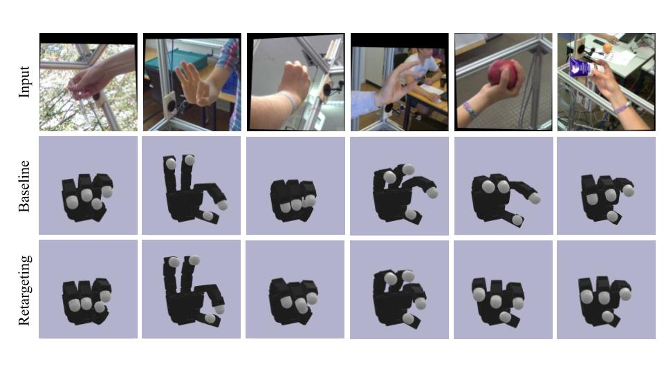

# Vision Retargeting Using Robot Aware Losses

[[Paper](.github/Vision_Retargeting.pdf)]

Monocular vision-based methods for kinematic retargeting from human to robot
hands have lagged behind motion capture and glove-based methods. In this paper, we present an improved vision-based retargeting method that incorporates
retargeting loss functions into the training of a 3D hand pose estimation model.
Instead of learning only keypoint locations, our model also learns to optimize for a
desirable retargeted robotic hand pose. As a result, our method improves upon the
downstream retargeting results compared to a baseline 3D pose estimation model,
beating the baseline pinch success rate on the Allegro Hand by 5.9%.

This project was completed under the supervision of Prof. David Meger for COMP 400 at McGill University.
